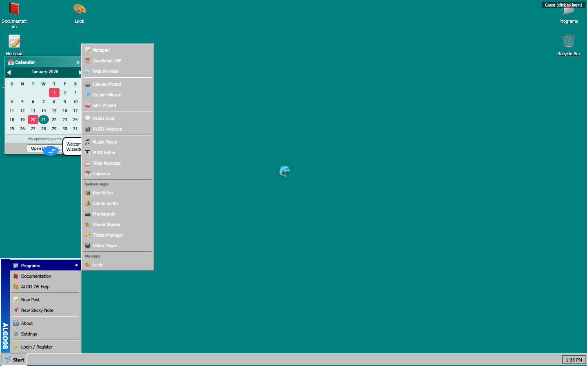

# Function Server

A multi-tenant cloud operating system that runs in the browser. Build apps visually, share publicly, run AI assistants.



## Quick Start

```bash
# Install on any server
curl -fsSL https://functionserver.com/install | bash

# Or try it live
https://functionserver.com/app
```

## What is Function Server?

Function Server is a complete operating system that runs in your browser. Every user gets:

- **Persistent Storage** - localStorage disk image that persists like a real hard drive
- **Desktop Environment** - Windows 98-style interface with draggable windows, taskbar, start menu
- **Built-in Apps** - Notepad, Calculator, Terminal, File Manager, and more
- **App Development** - JavaScript.IDE for building and running apps instantly
- **AI Integration** - Claude, GPT, and Gemini wizards built-in
- **Public Sharing** - Host files at `/username/` URLs

## Features

### JavaScript.IDE
Write apps using the ALGO API. Create windows, handle files, show notifications. Apps run instantly in the browser.

```javascript
ALGO.app.name = 'My App';
ALGO.app.icon = '🚀';

ALGO.createWindow({
  title: 'Hello World',
  width: 400,
  height: 300,
  content: '<h1>Welcome!</h1>'
});
```

### System Apps
Pre-installed apps managed by admins:
- **Shade Station** - WebGL shader editor
- **Ticket Manager** - Issue tracking with AI agent support
- **Photobooth** - Camera with word art effects
- **Box Editor** - ASCII/Unicode art editor
- **Chime Synth** - Sound effects synthesizer
- **Video Player** - YouTube/Vimeo player

### AI Wizards
Built-in AI assistants:
- **Claude Wizard** - Anthropic's Claude
- **GPT Wizard** - OpenAI's GPT
- **Gemini Wizard** - Google's Gemini

Plus full Claude Code support in the terminal.

### Ticket System
Built-in issue tracking. Create tickets, assign to AI agents, copy instructions for external Claude sessions.

### Public Folders
Every registered user gets a public folder at `/username/`. Share files, host static sites, build your portfolio.

## User Tiers

| Feature | Guest | Registered | Admin |
|---------|-------|------------|-------|
| Desktop & Apps | ✅ | ✅ | ✅ |
| AI Wizards | ✅ | ✅ | ✅ |
| localStorage | ✅ | ✅ | ✅ |
| Terminal | ❌ | ✅ | ✅ |
| Public Folder | ❌ | ✅ | ✅ |
| Claude Code | ❌ | ✅ | ✅ |
| System Apps Mgmt | ❌ | ❌ | ✅ |
| User Management | ❌ | ❌ | ✅ |

## App Architecture

Apps can be simple single-file scripts or complex multi-file projects:

```
my-app/
├── main.js           # App entry point
├── screens/
│   ├── home.layout   # Screen layouts (coming soon)
│   └── settings.layout
├── components/
│   ├── button.ui     # Reusable UI components
│   └── card.ui
└── app.json          # Metadata
```

### Designer Tool (Coming Soon)
Visual constraints-based layout editor. Drag components, set constraints, preview on multiple sizes.

### Craft Tool (Coming Soon)
Build reusable UI components with props, styles, and behavior.

## Installation

### One-Line Install
```bash
curl -fsSL https://functionserver.com/install | bash
```

### Custom Branding
```bash
curl -fsSL https://functionserver.com/install | bash -s -- --name "MyOS" --icon "🚀"
```

### Manual Installation
```bash
git clone https://github.com/williamsharkey/functionserver.git
cd functionserver/go
go build -o functionserver .
./functionserver
```

## Configuration

| Variable | Description | Default |
|----------|-------------|---------|
| `OS_NAME` | Display name | Function Server |
| `OS_ICON` | Emoji icon | ⚡ |
| `PORT` | Server port | 8080 |
| `DATA_DIR` | Data storage | ./data |
| `HOMES_DIR` | User homes | /home |

## Project Structure

```
functionserver/
├── core/
│   ├── algo-os.html     # Main OS (~5,000 lines)
│   ├── algo-os.css      # Extracted CSS (~1,400 lines)
│   └── apps/            # System apps
│       ├── shade-station.js
│       ├── ticket-manager.js
│       ├── photobooth.js
│       ├── box-editor.js
│       ├── chime-synth.js
│       └── video-player.js
├── go/
│   └── main.go          # Go backend
├── www/
│   ├── index.html       # Landing page
│   └── screenshots/     # Marketing assets
└── install/
    └── install.sh       # Installer script
```

## API Endpoints

| Endpoint | Description |
|----------|-------------|
| `GET /app` | Main OS interface |
| `GET /api/system-apps` | List system apps |
| `GET /core/apps/*.js` | System app code |
| `GET /:username/` | Public folder |
| `POST /api/terminal` | Terminal commands |
| `POST /api/login` | Authentication |

## Security

- Commands sandboxed to user home directory
- Dangerous commands blocked (sudo, chmod, etc.)
- Sessions expire after 7 days
- Passwords hashed with bcrypt
- Only .md/.txt served from /core/apps/

## Development

```bash
# Run locally
cd go && go build -o functionserver . && ./functionserver

# Run tests
cd www && node test-comprehensive.js

# Deploy to production
scp core/* root@functionserver.com:/opt/functionserver/core/
ssh root@functionserver.com "cd /opt/functionserver/go && go build && systemctl restart functionserver"
```

## Supported Platforms

| Platform | Status |
|----------|--------|
| Ubuntu/Debian | ✅ |
| CentOS/RHEL/Fedora | ✅ |
| Alpine | ✅ |
| Arch/Manjaro | ✅ |
| macOS | ✅ |
| WSL | ✅ |

## License

MIT

## Links

- **Live Demo**: https://functionserver.com/app
- **GitHub**: https://github.com/williamsharkey/functionserver
- **Issues**: https://github.com/williamsharkey/functionserver/issues
